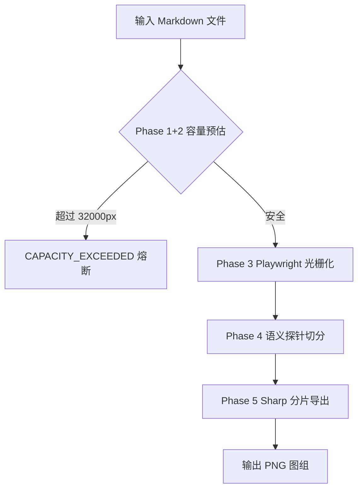
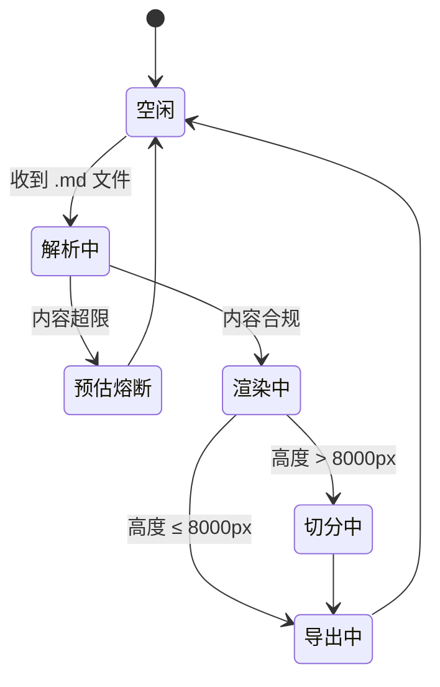

# 终极高阶排版示例：Mermaid + TaskLists + Highlights

这是一份展示 MD2POST 全部高级特性的示例文件，涵盖了 Mermaid 流程图、高亮标记、上下标、任务列表等富文本排版场景。

## MD2POST 渲染流水线

整个渲染流水线分为五个阶段，每个阶段有明确的职责边界：



如上图所示，引擎在进入昂贵的浏览器渲染步骤之前，会先通过毫秒级的 AST 扫描做一次容量预判，将超限内容**提前拦截**，而不是等待漫长渲染后才失败。

## 状态机示意



## 支持的高级格式

### 高亮与上下标

这里有 ==最高频使用的高亮底色==，让关键信息一眼被锁定。化学式如 H~2~O 和数学幂次如 10^2^ 均可精准对齐。

### 任务列表

- [x] Phase 1：AST 解析与高度预估熔断
- [x] Phase 2：HTML 模板注入（含 CSS Design Tokens）
- [x] Phase 3：Playwright 无头渲染与精确高度测量
- [x] Phase 4：DOM 坐标探针与语义切分算法
- [x] Phase 5：Sharp 高精度分片 PNG 导出
- [ ] 补充更多边缘案例的集成测试
- [ ] 探索 Linux / Windows 跨平台兼容性

### 斜体与加粗

支持 **加粗文本**、*斜体文本*、**_加粗斜体_**，以及 ~~删除线~~ 等标准内联格式。

### 引用块

> 这是一段引用。MD2POST 的设计理念是"大模型负责内容决策，引擎负责确定性的物理排版执行"。
> 两者之间有清晰的职责边界，互不越权。

### 代码块

```typescript
// 调用 MD2POST 只需一行命令
npx tsx src/index.ts -i ./your_article.md -t tech -l zh
```

### 表格

| 主题参数 | 描述 | 适用场景 |
|---------|------|---------|
| `tech` | 冷白底色 + 蓝紫系高亮 | 技术分享、产品分析 |
| `humanities` | 奶油暖白 + 赭红系点缀 | 书评、随笔、人文内容 |
| `emotion` | 深色底色 + 金色高亮 | 感悟、诗歌、情绪化内容 |
