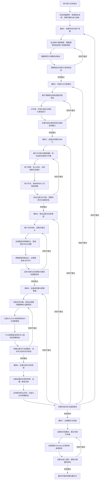

# Issue #83 Test

测试 TD 布局方向是否正确保持。

```mermaid
flowchart TD
    A[用户输入任务指令] --> B[目标深度解构：穿透商业本质，拆解可量化核心指标]
    B --> C[模块1：前置市场与用户洞察]
    C --> C1[自主细化调研维度：商圈/客群/竞品/商户全维度调研]
    C1 --> C2[数据填充与洞察结论输出]
    C2 --> C3[洞察报告合规性与有效性校验]
    C3 -->|校验通过| D[模块2：非遗IP与内容策划]
    C3 -->|校验不通过| C1
    D --> D1[基于洞察结论筛选适配非遗项目]
    D1 --> D2[IP打造、年轻化表达与商业化路径设计]
    D2 --> D3[非遗内容合规性校验与授权规范确认]
    D3 -->|校验通过| E[模块3：全案活动策划与执行]
    D3 -->|校验不通过| D1
    E --> E1[基于IP内容与客群洞察，拆分8周4阶段执行节奏]
    E1 --> E2[线下场景、线上玩法、分层客群活动细化]
    E2 --> E3[执行节点、落地标准与人员架构明确]
    E3 --> E4[活动方案与IP内容、预算约束交叉适配校验]
    E4 -->|校验通过| F[模块4：商业运营与成本管控]
    E4 -->|校验不通过| E1
    F --> F1[商户合作体系、招商方案设计]
    F1 --> F2[全周期成本明细拆分、营收预估与ROI测算]
    F2 --> F3[预算管控机制设计，总预算锁定780万内]
    F3 --> F4[成本方案与活动策划方案双向适配校验]
    F4 -->|校验通过| G[模块5：全渠道传播与舆情管理]
    F4 -->|校验不通过| F1
    G --> G1[匹配活动节奏，制定全周期传播策略与话题矩阵]
    G1 --> G2[分层KOL/KOC投放矩阵设计与效果管控]
    G2 --> G3[7*24h舆情监测体系与三级危机预案制定]
    G3 --> G4[传播方案与IP合规要求、活动节点双向对齐校验]
    G4 -->|校验通过| H[模块6：全案合规与风险防控]
    G4 -->|校验不通过| G1
    H --> H1[全案全模块合规性终审，设置一票否决权]
    H1 --> H2[全场景风险点识别、分级与应对预案制定]
    H2 --> H3[问题内容识别与退回修改]
    H3 -->|修改闭环| I[模块7：全案整合与定稿]
    H3 -->|校验不通过| C & D & E & F & G
    I --> I1[全模块内容整合，解决冲突与矛盾]
    I1 --> I2[全周期执行timeline与落地标准表制定]
    I2 --> I3[全案与核心目标、硬性约束最终校验]
    I3 -->|校验通过| J[最终可落地完整全案交付]
    I3 -->|校验不通过| I1
```

正常渲染测试。